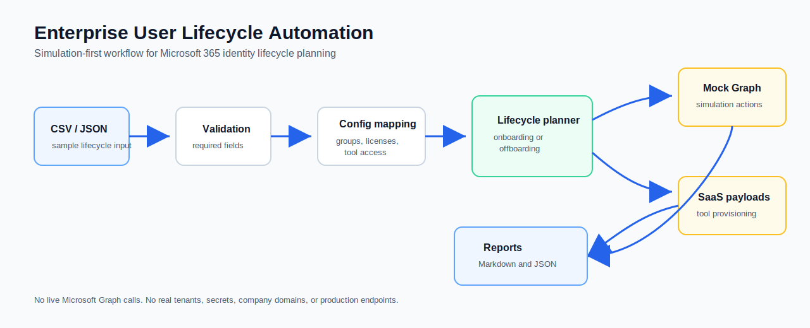

# Enterprise User Lifecycle Automation


Simulation-first Microsoft 365 identity lifecycle automation lab for planning onboarding and offboarding workflows with Python, PowerShell, mock Microsoft Graph actions, JSON configuration, reports, and CI.

This is a simulation-first lab project, not a production system. It uses mock users, fake group IDs, example domains, simulated Graph responses, and generated reports to show how an enterprise lifecycle automation workflow can be designed safely.

## Quick Demo

Run the sample workflows locally with Python. No external packages, Microsoft tenant, or Graph credentials are required.

```bash
python3 scripts/python/lifecycle_cli.py onboard --input data/sample-users.csv
python3 scripts/python/lifecycle_cli.py offboard --input data/sample-offboarding.csv
```

Compact output:

```text
Workflow: onboarding
Subject: Priya Shah <priya.shah@example.invalid>
Mode: simulation
Groups: 4
SaaS payloads: 5

Workflow: offboarding
Subject: priya.shah@example.invalid <priya.shah@example.invalid>
Mode: simulation
Groups: 4
SaaS payloads: 5
```

Generated reports are written to `reports/` as Markdown and JSON.

## What This Demonstrates

Enterprise user lifecycle work touches identity, licensing, SaaS access, audit evidence, and operational safety. This repository models those concerns as a small automation toolkit:

- Validate onboarding and offboarding input records.
- Generate standardized account identifiers.
- Resolve Microsoft 365 license assignments from configuration.
- Resolve Entra-style group assignments from department, region, and location.
- Generate SaaS provisioning and deprovisioning payloads.
- Prepare Microsoft Graph-style actions in simulation mode.
- Produce Markdown and JSON reports for review and audit handoff.
- Keep production execution intentionally disabled.

The result is a technical demo for enterprise automation, Microsoft 365 automation, identity lifecycle automation, and cloud automation review without implying that it is ready to run against a real tenant.

## What It Does Not Claim

- It does not connect to a real Microsoft 365 tenant.
- It does not create, disable, or modify real users.
- It does not include tenant IDs, client IDs, secrets, API keys, or production endpoints.
- It does not replace an access review, change approval, or HRIS source of truth.
- It is not production-ready.

## Architecture



```text
CSV or JSON input
  -> validators.py
  -> config_loader.py
  -> onboarding.py or offboarding.py
  -> tool_payloads.py
  -> graph_client_mock.py
  -> report_builder.py
  -> Markdown and JSON reports
```

| Layer | Responsibility |
| --- | --- |
| `assets/` | Architecture diagrams, demo output, and a concise project summary. |
| `config/` | Public-safe example mappings for groups, licenses, tools, and settings. |
| `data/` | Sample lifecycle inputs and mock Microsoft Graph response data. |
| `src/lifecycle/` | Python package for validation, configuration, workflow planning, mock Graph actions, SaaS payloads, and reports. |
| `scripts/python/` | CLI tooling for validation, report generation, and workflow execution. |
| `scripts/powershell/` | Microsoft 365 / Entra-style administrative scripts with simulation mode enforced. |
| `reports/` | Sample Markdown and JSON outputs generated from the demo data. |
| `tests/` | Unit tests covering validation, configuration, report output, CLI behavior, and SaaS payload generation. |

See [docs/architecture.md](docs/architecture.md) for more detail.

## Repository Tour

Start here if you are reviewing the implementation:

- [src/lifecycle/onboarding.py](src/lifecycle/onboarding.py) shows the onboarding workflow plan.
- [src/lifecycle/offboarding.py](src/lifecycle/offboarding.py) shows the offboarding workflow plan.
- [src/lifecycle/tool_payloads.py](src/lifecycle/tool_payloads.py) isolates SaaS provisioning and deprovisioning payload generation.
- [src/lifecycle/graph_client_mock.py](src/lifecycle/graph_client_mock.py) shows the Microsoft Graph simulation boundary.
- [config/department-group-map.example.json](config/department-group-map.example.json) shows configuration-driven group mapping.
- [reports/onboarding-report-sample.md](reports/onboarding-report-sample.md) and [reports/offboarding-report-sample.md](reports/offboarding-report-sample.md) show audit-style output.
- [assets/architecture-diagram.md](assets/architecture-diagram.md) and [assets/architecture-diagram.svg](assets/architecture-diagram.svg) provide a visual workflow overview.
- [docs/security-considerations.md](docs/security-considerations.md) documents the safety model and production hardening considerations.

## Features

- Onboarding from CSV or JSON.
- Offboarding from CSV or JSON.
- Required-field validation and date/email checks.
- Standardized UPN generation using a mock tenant domain.
- Department, region, and location based group mapping.
- Employment type based Microsoft 365 license mapping.
- SaaS payload generation for Slack, Box, Zoom, Notion, and Snipe-IT.
- Mock Microsoft Graph action planning with no network calls.
- Markdown and JSON report generation.
- PowerShell scripts with production execution blocked.
- GitHub Actions workflow for Python tests and compile checks.

## Tech Stack

| Area | Tools |
| --- | --- |
| Orchestration | Python 3.11+ |
| Admin scripting | PowerShell 7+ |
| Configuration | JSON |
| Input data | CSV or JSON |
| Reporting | Markdown and JSON |
| CI | GitHub Actions |
| Cloud concepts | Microsoft 365, Entra ID, Microsoft Graph, Azure Functions-style automation boundaries |

## Run Locally

No third-party Python packages are required.

```bash
python3 -m unittest discover -s tests -v
python3 scripts/python/validate_user_data.py onboarding --input data/sample-users.csv
python3 scripts/python/validate_user_data.py offboarding --input data/sample-offboarding.csv
python3 scripts/python/lifecycle_cli.py onboard --input data/sample-users.csv
python3 scripts/python/lifecycle_cli.py offboard --input data/sample-offboarding.csv
```

Optional PowerShell demos:

```powershell
pwsh -NoProfile -File scripts/powershell/Invoke-Onboarding.ps1
pwsh -NoProfile -File scripts/powershell/Invoke-Offboarding.ps1
```

## Example Onboarding Output

```text
Workflow: onboarding
Subject: Priya Shah <priya.shah@example.invalid>
Mode: simulation
Groups: 4
SaaS payloads: 5
Markdown report: reports/onboarding-report-01-priya-shah-at-example-invalid.md
JSON report: reports/onboarding-report-01-priya-shah-at-example-invalid.json
```

The generated report includes the normalized user record, generated account identifiers, resolved license, group assignments, SaaS payloads, mock Graph actions, and review recommendations.

## Example Offboarding Output

```text
Workflow: offboarding
Subject: priya.shah@example.invalid <priya.shah@example.invalid>
Mode: simulation
Groups: 4
SaaS payloads: 5
Markdown report: reports/offboarding-report-01-priya-shah-at-example-invalid.md
JSON report: reports/offboarding-report-01-priya-shah-at-example-invalid.json
```

The generated report includes sign-in disablement planning, session revocation planning, license removal, group removal, SaaS deprovisioning payloads, mailbox recommendations, and ticket metadata.

## Security Model

This project is mock-first and public-safe by design:

- `example.invalid` is used for all email domains.
- Group IDs are readable fake IDs such as `group-start2-engineering`.
- Microsoft Graph actions are represented as JSON simulation records.
- PowerShell scripts throw if `-ProductionMode` is used.
- Generated reports avoid secrets and production identifiers.
- `.gitignore` excludes local settings, environment files, secret material, and ad hoc generated reports.

See [SECURITY.md](SECURITY.md) and [docs/security-considerations.md](docs/security-considerations.md).

## Documentation

- [Architecture](docs/architecture.md)
- [Onboarding flow](docs/onboarding-flow.md)
- [Offboarding flow](docs/offboarding-flow.md)
- [Security considerations](docs/security-considerations.md)
- [Technical review guide](docs/technical-review-guide.md)
- [Roadmap issue ideas](docs/roadmap-issues.md)
- [Screenshots and sample outputs](docs/screenshots.md)
- [Architecture diagram](assets/architecture-diagram.md)
- [Demo output](assets/demo-output.md)
- [Project summary](assets/project-summary.md)

## Roadmap

Reasonable next steps for a lab environment are tracked in [docs/roadmap-issues.md](docs/roadmap-issues.md):

- Add an optional FastAPI wrapper for demo workflow requests.
- Add Azure Functions-style HTTP or queue trigger folders while preserving local execution.
- Add a production Graph adapter interface behind explicit approval and configuration gates.
- Add policy validation for group and license mappings.
- Add HTML report rendering for manager or audit review.
- Add generated architecture diagrams.

## License

MIT License. See [LICENSE](LICENSE).
